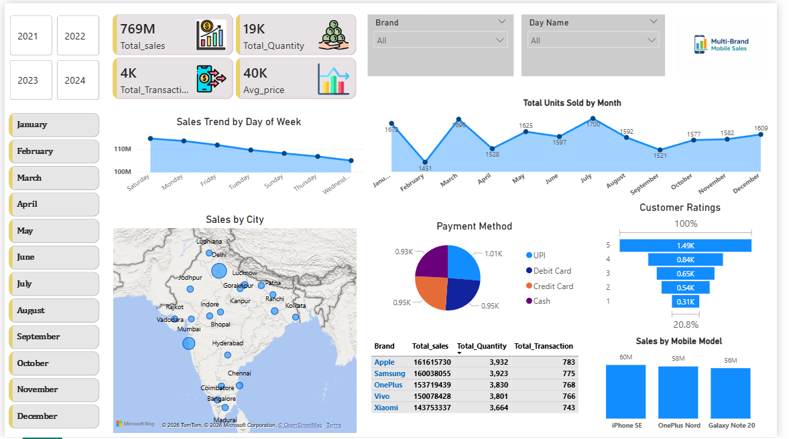

📊 Sales Performance Dashboard (Power BI)

📌 Project Overview
This project presents an interactive Sales Performance Dashboard developed using Power BI.
It helps analyze sales across cities, time periods, brands, and customer behavior.

🔍 Key Insights
- Total Sales, Transactions, Quantity, and Average Price KPIs
- Sales trends by Day and Month
- City-wise sales performance
- Brand and product-level analysis
- Payment method distribution
- Customer ratings overview

🛠 Tools & Technologies
- Power BI
- DAX (Basic)
- Excel
- Data Modeling

📷 Dashboard Preview

